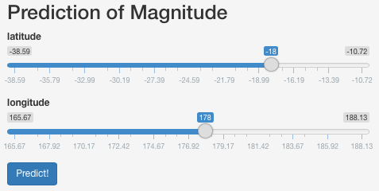
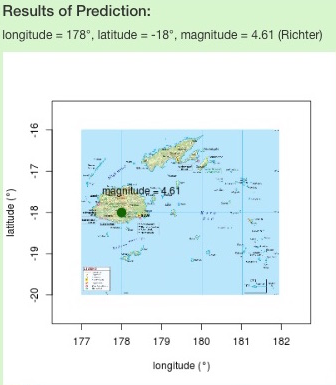
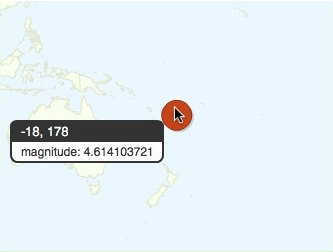

Earth Quakes on Fiji
========================================================
author: L. Fister
date: November 2015

Motivation: Predicting Quake Magnitude
========================================================

The Fiji islands are in a region of high seismologic activity. As a consequence, earth quakes pose a constant threat. Thus, an accurate prediction of their magnitude is of utmost importance to be able to impose precautionary measures.

This shiny web-application [(link)](https://leonardfister.shinyapps.io/DDP_project) addresses this issue. It uses the data from the R dataset "quakes" to estimate the magnitude of earth quakes in the region of Fiji based on the latitude and longitude.

Simple Usage
========================================================

1. adjust sliders for latitude and longitude
2. click on `Predict!`
3. see prediction numerically and visually



Details of the implementation are hidden (source code: [github](https://github.com/leonardfister/DDP_CourseProject)), application is easy to use and user-oriented. Data/package imports and computations are handled automatically. 


What happens under the hood?
========================================================

A linear regression model with predictors longitude and latitude (in degrees) predicts the magnitude (Richter) as outcome.

The model is defined in the file `server.R`, the building and prediction of the model is given by:

```r
data(quakes)
fit <- lm(mag ~ lat+long, data=quakes)
predict(fit,data.frame(lat=-18,long=178))[[1]]
```

```
[1] 4.614104
```
-18 & 178 are default values -> exchanged for slider input.

Results
========================================================

- numerical and visual prediction
- map on Fiji
- map of Oceania

  
